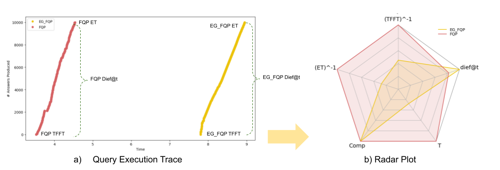

# DeTrusty in PLATOON (part of D2.8)

DeTrusty (formerly referred to as FQP; short for Federated Query Processing) is a federated query engine for SPARQL endpoints.
FQP decomposes the input query into star-shaped sub-queries, i.e., all triple patterns in a sub-query share the same subject.
This type of decomposition was proposed in ANAPSID [1] and has been proven to be very efficient in the presence of RDF data.
The source selection is guided by a semantic source description (see excerpt below).

```json
[
  {
    "rootType": "http://www.w3.org/2006/time#DateTimeDescription",
    "predicates": [
      {
        "predicate": "http://www.w3.org/2006/time#timeZone",
        "range": []
      },
      {
        "predicate": "http://www.w3.org/2006/time#unitType",
        "range": []
      }
    ],
    "linkedTo" : [],
    "wrappers": [
      {
        "url": "XXXXX",
        "predicates": [
          "http://www.w3.org/2006/time#timeZone",
          "http://www.w3.org/2006/time#unitType"
        ],
        "urlparam": "",
        "wrapperType": "SPARQLEndpoint"
      }
    ]
  },
  {
    "rootType": "http://www.w3.org/2006/time#Instant",
    "predicates": [
      {
        "predicate": "http://www.w3.org/2006/time#inDateTime",
        "range": []
      },
      {
        "predicate": "http://www.w3.org/2006/time#inXSDDateTimeStamp",
        "range": []
      }
    ],
    "linkedTo" : [],
    "wrappers": [
      {
        "url": "XXXXX",
        "predicates": [
          "http://www.w3.org/2006/time#inDateTime",
          "http://www.w3.org/2006/time#inXSDDateTimeStamp"
        ],
        "urlparam": "",
        "wrapperType": "SPARQLEndpoint"
      }
    ]
  }
]
```

If an RDF type statement is present in the sub-query, it will be used to identify the sources that contribute to the sub-query in question.
If no such statement is present, DeTrusty selects all sources that contribute to RDF classes that contain all predicates of the sub-query.
This allows DeTrusty to minimize the number of contacted endpoints.
Each sub-query is executed over the previously selected sources for it.
The partial results retrieved from the endpoints are combined at the query engine level using non-blocking operators following the same idea already presented in ANAPSID [2].
DeTrusty creates bushy plans in order to speed up the query execution.
These features enable DeTrusty to continuously generate complete and sound query results while minimizing the number of contacted endpoints and query execution time.
This is in contrast to state-of-the-art federated query engines like FedX [3] which creates left-linear plans based on exclusive groups, i.e., decomposing the query into sub-queries that can be answered exclusively by one endpoint.
The current version of DeTrusty is capable of executing SPARQL SELECT queries.
The SERVICE clause from SPARQL 1.1 is also implemented.
Some SPARQL 1.1 features are not yet implemented, e.g., the HAVING clause, built-in functions, and complex expressions in aggregates.
DeTrusty can be run in a Docker container.
After providing DeTrusty with the semantic source description of the set of SPARQL endpoints, it can be used via its HTTP API as if it was a regular SPARQL endpoint.
Additionally, a graphical user interface can be accessed from the browser.

## Empirical Evaluation of DeTrusty
DeTrusty is empirically evaluated in order to answer the following research questions:

1. What is the impact of query decomposition in federated query processing?
2. What is the effect of query planning in continuous query answering?

### Benchmark Data and Queries
DeTrusty is evaluated over the knowledge graph of [pilot 2a](https://github.com/PLATOONProject/Pilot2A-Data-Integration).
Five SPARQL queries are defined.
See the table below for more details on the queries.
The actual queries can be found in the directory `queries`.

| Query | Description                                                                | #Triple Patterns | #Results  |
|-------|----------------------------------------------------------------------------|------------------|-----------|
| Q1    | Pressure values and the assets generating the measurements                 | 9                | 14,527    |
| Q2    | Humidity values, the assets generating the measurement, and their location | 9                | 43,680    |
| Q3    | Values from active power evaluations                                       | 5                | 1,194,991 |
| Q4    | Values from electric power evaluations                                     | 5                | 1,194,991 |
| Q5    | Humidity values and the property holding the information                   | 5                | 14,527    |

### Federated Query Processing Methods
The following federated query processing methods are compared:

- **Baseline:** a query is executed over a knowledge graph through a SPARQL endpoint. It recreated a query evaluation without the use of a query engine.
- **Exclusive Groups (EG-FQP):** the execution of a query is posed over a knowledge graph via a SPARQL endpoint. The query planner schedules the execution of the query in blocks according to an estimated cardinality of the answer. This execution resembles the federated query processing strategies implemented in the state-of-the-art SPARQL query engine FedX [3].
- **Federated Query Processing on Star-Shaped Groups (FQP):** a SPARQL query is decomposed into star-shapes sub-queries over the same subject. The execution of the sub-queries is scheduled in a bushy tree where the leaves of the tree correspond to the sub-queries and internal nodes represent physical operators that merge the reults produces by the subtrees that correspond to the node's children. The star-shaped sub-queries are executed in blocks; this decision is taken by the planner based on the selectivity of each sub-query. These strategies are part of DeTrusty as the PLATOON FQP and also in ANAPSID [2], MULDER [4], and Ontario [5].

### Metrics
The three query processing techniques are compared in terms of the following metrics:

- **Execution Time:** Elapsed time between the submission of a query to a query engine and the generation of the answers. Time corresponds to absolute wall-clock system time as reported by the Python time.time() function.
- **Completeness:** Query result percentage with respect to the query answer cardinality.
- **Diefficiency at time _t_:** dief@t [6] measures the continuous efficiency of an engine in the first _t_ time units of query execution. The Diefficiency metric is described in terms of:
  - time for the first tuple (TFFT)
  - total execution time (ET)
  - number of answers procuded (comp), and
  - throughput (T).
  
  dief@t computes the area-under-the-curve (AUC) of the answer distribution until time _t_; a higher value means the query engine has a steadier answer production.

### Computational Environment
The pipeline described in the repository of [Pilot 2a](https://github.com/PLATOONProject/Pilot2A-Data-Integration) is executed to create the pilot 2a knowledge graph.
All containers run at the same server and network cost is neglected.
The knowledge graph is accessible via a SPARQL endpoint implemented in Virtuoso 6.01.3127 configured to use up to 16 GiB of memory.
The experiments are executed on an Ubuntu 18.04.4 LTS 64 bit machine with an Intel(R) Xeon(R) E5-1630v4 CPU and 64 GiB DDR4 RAM. 

### Efficiency of the PLATOON Federated Query Processing Strategies
The efficiency of the developed federated query engine (DeTrusty) is measured in terms of the time required to produce all the answers to a query (i.e., elapsed time).
The five queries are executed using the three federated query processing strategies described above.
The timeout is set to 10 minutes.
All caches are flushed between the execution of two queries to ensure reproducibility.
The block or 'pagination' is configured to 10,000 answers.
The table below reports the elapsed time (secs) to produce the first result for all three strategies.
The percentage of improvement concerning the baseline approach is also reported.
As can be observed, the speed-up to the first result is especially high for executing non-selective queries (i.e., Q3 and Q4) with EG_FQP and FQP (the strategy used in PLATOON's federated query engine).
The studied federated query processing strategies also speed up the generation of the first answer compared to the baseline approach for other queries.

<table>
  <tr>
    <th rowspan="2">Query</th>
    <th rowspan="2">Baseline (secs.)</th>
    <th colspan="2">EG_FQP</th>
    <th colspan="2">FQP</th>
  </tr>
  <tr>
    <th>EG_FQP (secs.)</th>
    <th>%Speed up</th>
    <th>FQP (secs.)</th>
    <th>%Speed up</th>
  </tr>
  <tr>
    <td>Q1</td>
    <td>6.12</td>
    <td>4.49</td>
    <td>26.65%</td>
    <td><b>4.27</b></td>
    <td><b>30.26%</b></td>
  </tr>
  <tr>
    <td>Q2</td>
    <td>11.85</td>
    <td>2.43</td>
    <td>79.48%</td>
    <td><b>0.75</b></td>
    <td><b>93.67%</b></td>
  </tr>
  <tr>
    <td>Q3</td>
    <td>80.08</td>
    <td><b>0.63</b></td>
    <td><b>99.21%</b></td>
    <td>0.70</td>
    <td>99.11%</td>
  </tr>
  <tr>
    <td>Q4</td>
    <td>104.69</td>
    <td>0.88</td>
    <td>99.16%</td>
    <td><b>0.64</b></td>
    <td><b>99.39%</b></td>
  </tr>
  <tr>
    <td>Q5</td>
    <td>1.33</td>
    <td>0.95</td>
    <td>28.24%</td>
    <td><b>0.73</b></td>
    <td><b>45.32%</b></td>
  </tr>
</table>

### Continuous Behavior of the PLATOON Federated Query Processing Strategies
The baseline produces all the results simultaneously, while EG_FQP and FQP output answers incrementally.
The assessment outcomes of these engines' behavior are visualized in radar plots.
The following figure explains the meaning of the metrics presented in the radar plot in terms of the trace of the execution of a query (subfigure a).



As can be seen in the figure below, FQP outperforms EG_FQP in terms of continuous behavior for the queries Q1, Q2, Q3, and Q4.
EG_FQP performs slightly better for query Q5.
Q5 is a very simple query, hence, splitting the query into sub-queries adds some overhead.
The traces for Q1 and Q2 show the continuous answer generation of FQP while EG_FQP generated the answers in portions.
For Q3 and Q4 both approaches show a steady generation of the query results even though the answer generation rate drops a little after the first 200,000 results.
However, FQP maintains a higher rate than EG_FQP.


## References
[1] M.-E. Vidal, E. Ruckhaus, T. Lampo, A. Martínez, J. Sierra, A. Polleres. Efficiently Joining Group Patterns in SPARQL Queries. In _The Semantic Web: Research and Applications. ESWC 2010_. [https://doi.org/10.1007/978-3-642-13486-9_16](https://doi.org/10.1007/978-3-642-13486-9_16)

[2] M. Acosta, M.-E. Vidal, T. Lampo, J. Castillo, E. Ruckhaus. ANAPSID: An Adaptive Query Processing Engine for SPARQL Queries. In _The Semantic Web - ISWC 2011_. [https://doi.org/10.1007/978-3-642-25073-6_2](https://doi.org/10.1007/978-3-642-25073-6_2)

[3] A. Schwarte, P. Haase, K. Hose, R. Schenkel, M. Schmidt. FedX: Optimization Techniques for Federated Query Processing on Linked Data. In _The Semantic Web - ISWC 2011_. [https://doi.org/10.1007/978-3-642-25073-6_38](https://doi.org/10.1007/978-3-642-25073-6_38)

[4] K. M. Endris, M. Galkin, I. Lytra, M. N. Mami, M.-E. Vidal, S. Auer. Querying Interlinked Data by Bridging RDF Molecule Templates. In _Transactions on Large-Scale Data and Knowledge-Centered Systems_, 2018. [https://doi.org/10.1007/978-3-662-58415-6_1](https://doi.org/10.1007/978-3-662-58415-6_1)

[5] K. M. Endris, P. D. Rohde, M.-E. Vidal, S. Auer. Ontario: Federated Query Processing against a Semantic Data Lake. In _DEXA 2019: Database and Expert System Applications_. [https://doi.org/10.1007/978-3-030-27615-7_29](https://doi.org/10.1007/978-3-030-27615-7_29)

[6] M. Acosta, M.-E. Vidal, Y. Sure-Vetter. Diefficiency Metrics: Measuring the Continuous Efficiency of Query Processing Approaches. In _The Semantic Web - ISWC 2017_. [https://doi.org/10.1007/978-3-319-68204-4_1](https://doi.org/10.1007/978-3-319-68204-4_1)
